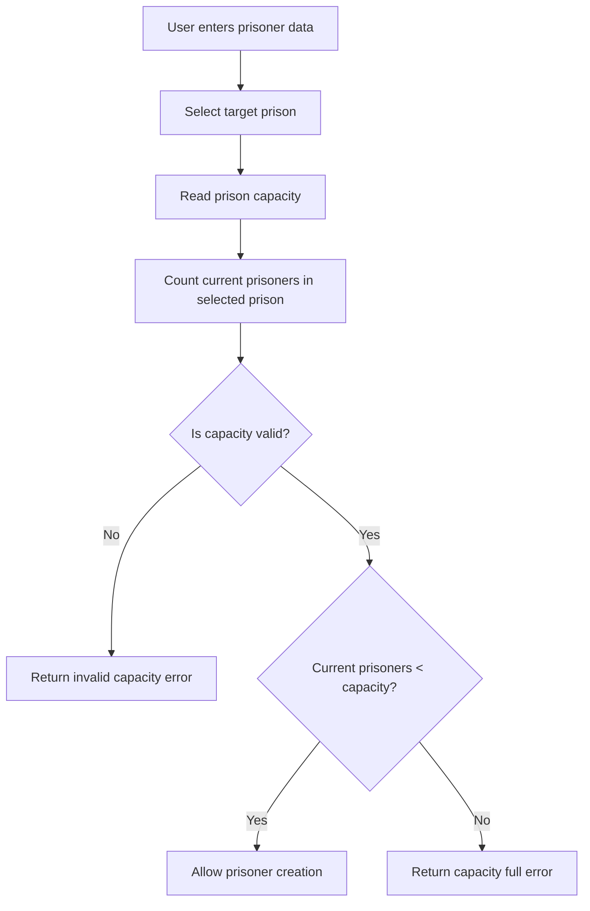

# EXP-2026-05-12: Pure Function Experiment

## Feature

Prison Capacity Validation

## Prompt Provided to AI

Create the logic for the following feature as a pure function.

Requirements:

User Story:
As a prison administration staff member, I want the system to prevent adding a prisoner when the selected prison is already full, so that prison capacity limits are respected and database records stay valid.

Acceptance Criteria:

AC1:
Given a prison has a capacity of 10 and currently has 9 prisoners
When the user tries to add one new prisoner to that prison
Then the system allows the prisoner to be added

AC2:
Given a prison has a capacity of 10 and currently has 10 prisoners
When the user tries to add one new prisoner to that prison
Then the system rejects the action and returns a capacity error

AC3:
Given the prison capacity is missing or lower than the current prisoner count
When the system validates whether a new prisoner can be added
Then the system rejects the action and returns an invalid capacity error

Mermaid diagram:



Strict constraint:
Write the logic for this feature as a Pure Function. It must have no side effects, must be stateless, must not access the database, must not modify global variables, and must return a predictable output.

## AI Output

```python
def validate_prison_capacity(capacity, current_prisoner_count):
    if capacity is None:
        return {
            "allowed": False,
            "reason": "invalid_capacity"
        }

    if not isinstance(capacity, int) or not isinstance(current_prisoner_count, int):
        return {
            "allowed": False,
            "reason": "invalid_capacity"
        }

    if capacity < 0 or current_prisoner_count < 0:
        return {
            "allowed": False,
            "reason": "invalid_capacity"
        }

    if capacity < current_prisoner_count:
        return {
            "allowed": False,
            "reason": "invalid_capacity"
        }

    if current_prisoner_count >= capacity:
        return {
            "allowed": False,
            "reason": "capacity_full"
        }

    return {
        "allowed": True,
        "reason": "capacity_available"
    }
```

## Did the AI succeed on the first try?

Yes. The generated function is pure because:

- It only uses input parameters.
- It does not access the database.
- It does not change global state.
- It does not print, save, insert, delete, or update anything.
- The same input always returns the same output.

## Did I have to adjust the requirements or diagram?

No major adjustment was needed. The BDD requirements and Mermaid flowchart were specific enough for the AI to generate a predictable pure function.

## Result

The experiment shows that strict BDD requirements and UML-as-code can guide AI toward safer code generation. Instead of asking the AI to directly modify the database or GUI, the feature logic was isolated into a pure validation function.
